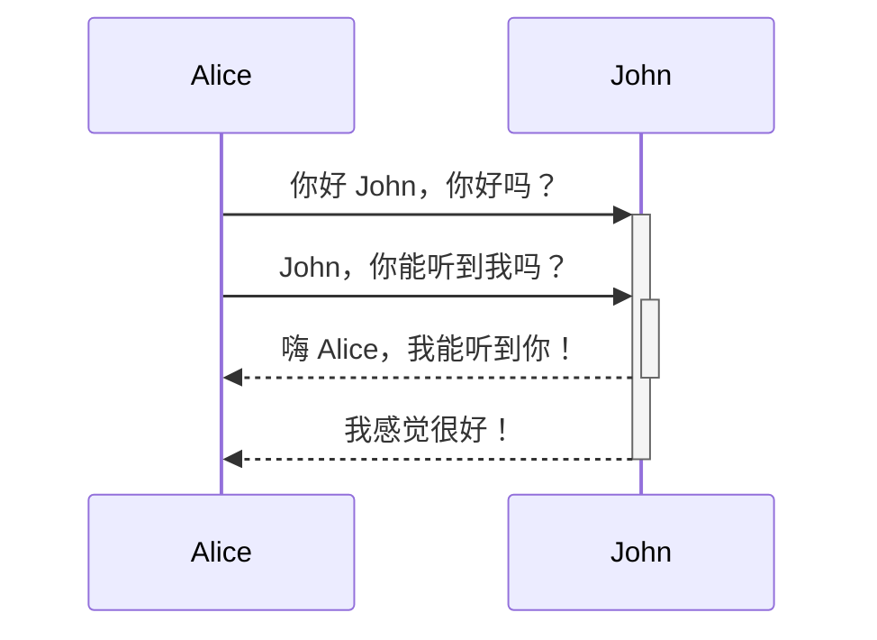

### 标签
>[!tip] 标注可以自定义标题
>可以用来写一些标题和定义或者题目与正文做区分

> [!question] 标注可以嵌套吗？
> > [!todo] 可以。
> > > [!example]  你甚至可以使用多层嵌套。

>[!note]
>>[!info]
>>>[!todo]
>>>>[!tip] 这里我将几种常见的标注嵌套做例子

他们有不同图标
> [!success]

> [!question]

> [!example]


### 表格(不好用暂时放弃)

| 名字  | 姓氏  |
| --- | --- |
| 麦克斯 | 普朗克 |
| 玛丽  | 居里  |
### 图表(类似流程图)
运用Mermaid语法,较为复杂暂时不做深入学习


### 粗体、斜体、高亮
正常
**粗体**
*斜体*        _另一种斜体_
~~删除文本~~
==高亮==
**粗体和 _嵌套斜体_ 文本**
***粗斜体***

### 引用
> 这是一句名人名言。

\-我说的，2025

### 列表
你可以在文本前加上 `-`、`*` 或 `+` 来创建无序列表。
- 第一条
- 第二条
- 第三条
要创建有序列表，每行以数字加上 `.` 开头。
1. 第一条
2. 第二条
3. 第三条
#### 任务列表
要创建任务列表，每个列表项以连字符和空格开头，后跟 `[ ]`。
- [x] 已完成任务
- [ ] 未完成任务
#### 嵌套列表
1. 第一条
	 - 第一小条
	 - 第二小条
2. 第二条

- [ ] 任务项 1
	- [ ] 子任务 1
- [ ] 任务项 2
	- [ ] 子任务 1
### 水平线 
---
$\uparrow$ 上面就是一条水平线
你可以在单独的一行上使用三个或更多星号 `***`、短横线 `---` 或下划线 `___` 来添加水平线。这些分隔符号里允许有空格。

### 代码
---
`反引号中的文本会被转化成代码格式`
#### 代码块
```js
function fancyAlert(arg) {
  if(arg) {
    $.facebox({div:'#foo'})
  }
}
```

### 脚注
---
这是一个简单的脚注[^1]。

[^1]: 这是脚注的内容文本。
[^2]: 在每一行的开头添加 2 个空格，
  可以编写跨越多行的脚注。
[^注释]: 可以使用非数字来命名脚注。但渲染时，脚注仍然会显示为数字。这样可以更容易地识别脚注内容。

### 注释
这是一个 %%行内%% 注释。

%%
这是一个块注释。

块注释可以跨多行。
%%
